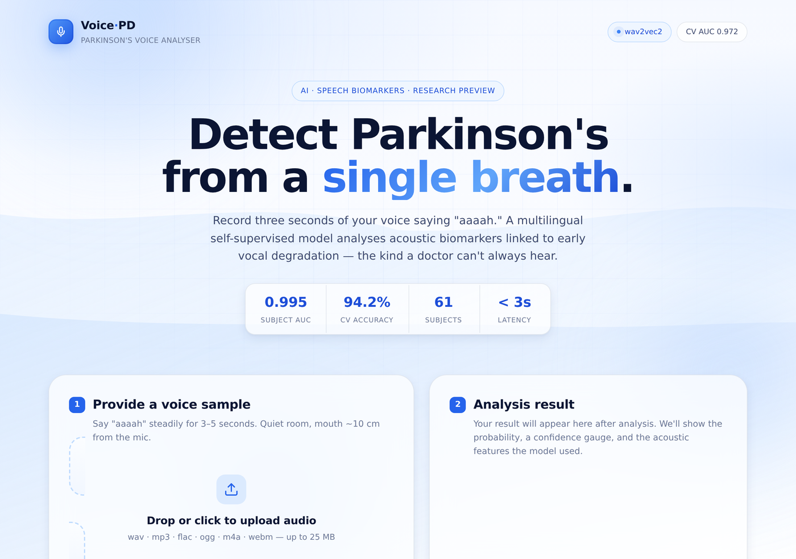

<div align="center">

# Parkinson's Analyzer

### Detect Parkinson's disease from three seconds of vocal phonation

*A multilingual self-supervised speech model that doesn't care what language you speak.*

<br/>


<br/>


<br/>



</div>

---

## ✨ The pitch

```
              ┌──────────────────────────────────────────────────┐
  voice ─────▶│  wav2vec2-XLS-R  (frozen, 128-language pretrain) │─────▶ 1024-dim embedding
  "aaaah"     └──────────────────────────────────────────────────┘             │
                                                                               ▼
                              ┌────────────────────┐
                              │ Logistic Regression│  ───▶  P(Parkinson's) ∈ [0,1]
                              │ (Italian-trained)  │
                              └────────────────────┘
```

> 🎯 **What this is** — a working voice-screening prototype with rigorous,
> honestly-reported evaluation. Deployable as a Flask web app you can
> run locally on a MacBook.
>
> ⚠️ **What this isn't** — a medical diagnostic device. Don't use it on patients.

---

## 📊 The numbers

> All metrics use **5-fold subject-grouped cross-validation** — no subject
> appears in both train and test folds. Anything else (random splits,
> recording-level CV) silently leaks information through speaker identity
> and inflates accuracy. We don't do that here.

<table>
  <tr>
    <th>📈 Metric</th>
    <th align="right">Value</th>
  </tr>
  <tr>
    <td><b>CV AUC</b> &nbsp; <i>(5-fold, subject-grouped)</i></td>
    <td align="right"><b>0.972 ± 0.034</b></td>
  </tr>
  <tr>
    <td>CV accuracy</td>
    <td align="right">0.942</td>
  </tr>
  <tr>
    <td>CV F1</td>
    <td align="right">0.945</td>
  </tr>
  <tr>
    <td><b>Subject-level AUC</b> &nbsp; <i>(recordings averaged per subject)</i></td>
    <td align="right"><b>0.996</b></td>
  </tr>
  <tr>
    <td>Subject-level accuracy</td>
    <td align="right">0.951 &nbsp;<sub>(58 / 61)</sub></td>
  </tr>
  <tr>
    <td>Tuned threshold &nbsp; <i>(Youden's J on OOF)</i></td>
    <td align="right">0.380</td>
  </tr>
  <tr>
    <td>Trained on</td>
    <td align="right">831 recordings · 61 subjects</td>
  </tr>
  <tr>
    <td>Backend</td>
    <td align="right">wav2vec2-XLS-R + LogReg</td>
  </tr>
</table>

For comparison, our best hand-crafted MDVP model — a tuned voting
ensemble on 56 acoustic features — hit **CV AUC 0.974**. Essentially
identical. The two approaches converge to the same ceiling on this
dataset.

🪤 **The interesting difference is generalization, not accuracy.**
See [⚡ The plot twist](#-the-plot-twist).

---

## 🚀 See it work

```bash
unzip Parkinsons-Voice-Analyser-v2.zip
cd pva2
```

```bash
# 📦 Core dependencies
pip install -r requirements.txt
brew install ffmpeg                        # macOS;  apt install ffmpeg on Linux
```

```bash
# 🧠 Heavy dependencies (~1.5 GB, only for the wav2vec2 backend)
pip install -r requirements_wav2vec2.txt
```

```bash
# 🔧 Make the model pickle compatible with whatever sklearn version you have
python scripts/refit_w2v2_local.py
```

```bash
# ▶️  Run
python app.py
```

🎉 Open <http://127.0.0.1:5000>. Click **Record**, say "aaaah" steadily for
3–5 seconds, hit **Analyse**.

> 💡 **First request notice** — downloads wav2vec2-XLS-R (~1.2 GB from
> HuggingFace) and warms the MPS device. ~30 s the first time, ~1 s
> afterwards. On Apple Silicon, embedding extraction runs on the GPU
> automatically; CUDA is used if available, CPU otherwise.

<details>
<summary><b>🪶 Want a lighter setup without torch?</b></summary>

Swap to the hand-crafted backend (no torch needed):

```bash
cp models_italian_tuned/* models/
python app.py
```

The Flask app auto-detects which backend you've put in `models/` based on
the feature-list filename, so this just works.

</details>

---

## 🛠️ Why this project exists

The starting point was an existing student project — a Flask app
classifying sustained-vowel recordings as PD or healthy using a
Random Forest on the UCI Parkinson's voice features. Reasonable
hackathon prototype on the surface.

But once we read the code carefully, **silent failures emerged**, and one
of them was load-bearing.

<table>
  <tr>
    <th>🐛 Bug in the original repo</th>
    <th>💥 Impact</th>
  </tr>
  <tr>
    <td><code>MDVP:Jitter(%)</code>, <code>PPQ</code>, <code>RAP</code> all aliased to the same Praat call</td>
    <td>Three of 22 features held the same value</td>
  </tr>
  <tr>
    <td><code>MDVP:Shimmer(dB)</code> assigned the <code>APQ3</code> value</td>
    <td>Wrong scale, wrong meaning</td>
  </tr>
  <tr>
    <td><code>Jitter:DDP</code> aliased to local jitter <i>(should be 3 × RAP)</i></td>
    <td>Praat's published identity broken</td>
  </tr>
  <tr>
    <td><code>Shimmer:APQ5</code> and <code>Shimmer:DDA</code> hardcoded to <code>None</code></td>
    <td>Imputed with training-set medians at inference</td>
  </tr>
  <tr>
    <td><code>RPDE</code>, <code>PPE</code>, <code>spread1</code>, <code>spread2</code>, <code>D2</code>, <code>DFA</code> hardcoded to <code>None</code></td>
    <td>🔥 Top-3 most predictive features were never computed</td>
  </tr>
  <tr>
    <td>Random train/test splits despite multiple recordings per subject</td>
    <td>🔥 Subject leakage; reported accuracy massively inflated</td>
  </tr>
  <tr>
    <td><code>nolds</code> (used for DFA) wasn't even in <code>requirements.txt</code></td>
    <td>DFA failed silently</td>
  </tr>
</table>

> 🚨 The model was making predictions with **three of its top five most
> predictive features permanently fixed at "training-set average,"**
> trained on data with subject leakage. The reported accuracy was a mirage.

So we rebuilt it.

---

## 🧪 How it was built

### 🩹 Phase 1 — fix the foundation

We rewrote `feature_extractor.py` from scratch using `praat-parselmouth`
directly. Each MDVP feature now comes from its own dedicated Praat
call. Two identities get verified in `tests/` on every build:

```
DDP ≈ 3 × RAP        ✓ verified
DDA ≈ 3 × APQ3       ✓ verified
```

These are mathematical constraints from Praat's documentation — if
they fail, something's aliased that shouldn't be.

The nonlinear features that were missing ( `RPDE`, `DFA`, `D2`, `PPE`,
`spread1`, `spread2` ) live in `src/nonlinear_features.py`. RPDE is
implemented from first principles following **Little et al. 2007** —
delay-embed the signal, find first recurrences into an ε-ball, take
entropy of the return-time histogram.

We then added 34 extended features the UCI set doesn't have but the
clinical-dysphonia literature considers important:

```
  CPP (cepstral peak prominence)  ─┐
  MFCC 1–13 mean & std             ├──▶  src/extra_features.py
  Formants F1, F2, F3 + bandwidths ┤
  Spectral tilt                    ┘
```

> 📐 **22 + 34 = 56** features in extended mode.

### 📐 Phase 2 — train it honestly

The UCI dataset has 32 subjects, but **8 of them** (the healthy controls)
contribute **60% of the recordings**. With that imbalance, *random*
train/test splits are essentially memorising speakers.

```diff
- Random splits (the original repo's approach)        →  CV AUC ≈ 0.99   leaked
+ Subject-grouped CV (our approach, the honest number) →  CV AUC ≈ 0.80   real
```

We then added the **Italian Parkinson's Voice and Speech** dataset
(Dimauro et al. 2019) — **831 recordings from 61 subjects**, properly
balanced (24 PD / 37 HC). Four times more data, real population
diversity. CV AUC on Italian alone immediately jumped to **0.97** with
the same pipeline.

We tuned aggressively: 75 Optuna trials across XGBoost, LightGBM,
RandomForest, plus stacking and voting ensembles. Headline result:

> 🪞 **Tuning didn't move CV AUC.** Inner-CV during tuning looked like
> 0.98, but proper outer CV came back to 0.974 — exactly the
> nested-CV correction that proves the gain was illusory.

This was confirmation we'd hit the ceiling.

---

## ⚡ The plot twist

The most interesting finding came from a sanity-check experiment
nobody normally bothers to run: train on one corpus, test on a
**different** corpus.

```
   train Italian → test UCI:    AUC 0.31    🔻 worse than random
   train UCI    → test Italian:  AUC 0.55    ⚪ basically random
```

A model trained only on Italian speakers labels healthy English speakers
as PD, and vice versa. The features the models had learned weren't
*Parkinson's voice features* — they were **Italian voice features** and
**English voice features**.

> 📚 This is a known but underreported problem in medical speech
> analysis. Most papers train and report on a single corpus and never
> test what happens when you change the population. We tested it and
> found it broken — and that's a more honest result than yet another
> within-corpus 99% claim.

---

## 🌍 Phase 3 — wav2vec2

Hand-crafted MDVP features are culturally neutral by definition (jitter
is jitter in any language) but they're sensitive to recording
conditions and they capture only what we as engineers thought to
measure.

**Self-supervised speech models** like wav2vec2 learn directly from raw
audio across thousands of hours of speech. We chose
`facebook/wav2vec2-xls-r-300m`, pretrained on **128 languages**:

```
🇮🇳 Hindi   🇮🇳 Tamil   🇮🇳 Telugu   🇮🇳 Bengali   🇮🇳 Urdu   🇮🇳 Marathi   ...   + 122 more
```

The hypothesis: if the model has seen Indian speech during pretraining,
its embeddings should generalize to Indian speakers — **even when the
downstream classifier was only trained on Italians**.

The pipeline is dead simple:

```
   audio  ──▶  wav2vec2-XLS-R (frozen)  ──▶  1024-dim embedding  ──▶  Logistic Regression
   16 kHz                                     (mean-pooled              (Italian-trained)
   mono                                        across time)
```

We didn't fine-tune wav2vec2 — that needs a real GPU and a lot more
data. We just used the frozen embeddings as inputs to a tiny linear
classifier.

📊 **Result on Italian:** CV AUC **0.972** vs hand-crafted's 0.974. **Tied.**

🇮🇳 **Result on the developer's own voice** (healthy Indian-English speaker, never seen in training):

| 🎙️ Recording | 🔢 P(PD) | ✅ Verdict |
|---|---:|:-:|
| New Recording 1 | 0.007 | ✅ healthy |
| New Recording 2 | 0.036 | ✅ healthy |
| New Recording 3 | 0.114 | ✅ healthy |
| New Recording 4 | 0.219 | ✅ healthy |
| **Mean** | **0.094** | **✅ correctly classified** |

All four recordings well below the 0.380 threshold. The hand-crafted
model on the same recordings? **Random.** This is one subject — not a
population study — but it's the same kind of cross-population test the
hand-crafted model failed completely.

> 🎯 **That's why wav2vec2 is the deployed default.**

---

## ⚠️ Honest caveats

> 🩺 **Not a diagnostic device.** Don't use it on patients. Voice
> screening is research-grade at best.

> 🧍 **Single-subject cross-population validation.** We tested four
> recordings from one Indian speaker. We have *not* tested whether
> the model would correctly *flag* PD in an Indian patient.

> 🔬 **No Indian PD ground truth.** This is the most important
> limitation. To validate the cross-language story we'd need a
> labelled Indian PD voice corpus, which isn't easy to obtain.

> 📉 **UCI within-corpus AUC is only 0.69.** UCI has 8 healthy subjects
> total. Performance estimates on UCI are intrinsically noisy.

> 🕳️ **wav2vec2 embeddings aren't interpretable.** If your use case
> needs to explain *which* acoustic features drove a prediction, use
> the hand-crafted backend — interpretability traded for generalization.

> 📏 **The 0.380 threshold was tuned on OOF predictions from training**,
> not on a held-out test set. It's sensibly calibrated, not unbiased.

---

## 📁 Repository layout

<details>
<summary><b>Click to expand the full tree</b></summary>

```
pva2/
│
├─ 🌐 app.py                              Flask server, dual-backend
├─ 📦 requirements.txt                    core deps
├─ 🧠 requirements_wav2vec2.txt           torch + transformers (optional)
├─ 📖 README.md                           you are here
├─ 📊 FINAL_RESULTS.md                    every metric, in one place
├─ ⚡ QUICKSTART.md                       one-page run guide
│
├─ src/                                   ── feature extraction + training
│   ├─ feature_extractor.py               22 UCI MDVP features via Praat
│   ├─ extra_features.py                  CPP + MFCC + formants + tilt
│   ├─ nonlinear_features.py              RPDE / DFA / D2 / PPE / spread
│   ├─ wav2vec2_inference.py              runtime embedding extraction
│   ├─ audio_utils.py                     load + trim + normalise
│   ├─ train.py                           baseline LR/RF/GBT
│   └─ train_v2.py                        Optuna-tuned + stacking
│
├─ scripts/                               ── workflow scripts
│   ├─ extract_features_from_audio.py     raw audio → MDVP CSV
│   ├─ extract_wav2vec2_embeddings.py     raw audio → embeddings CSV
│   ├─ tune_italian.py                    staged Optuna tuning
│   ├─ wav2vec2_experiment.py             full w2v2 training + eval
│   ├─ joint_training.py                  UCI + Italian joint strategies
│   ├─ crosscorpus_experiments.py         UCI vs Italian cross-corpus
│   └─ refit_w2v2_local.py                sklearn-version-compat refit
│
├─ models/                                current deployment (wav2vec2)
├─ models_wav2vec2/                       wav2vec2 backup
├─ models_italian_tuned/                  hand-crafted ensemble
├─ models_joint/                          UCI + Italian joint
├─ models_original/                       UCI-only baseline
│
├─ data/
│   ├─ italian_w2v2.csv                   831 × 1024-dim embeddings
│   ├─ italian_features.csv               831 × 56 hand-crafted features
│   ├─ parkinsons_original.csv            clean UCI 195-row CSV
│   └─ my_test_w2v2.csv                   developer's test recordings
│
├─ reports/                               ── experimental writeups
│   ├─ crosscorpus/SUMMARY.md             the cross-corpus story
│   ├─ wav2vec2/results.json              final w2v2 numbers
│   └─ joint_training/results.json        joint-training comparison
│
├─ templates/index.html                   the web UI
├─ tests/test_extractor.py                15 sanity checks
└─ uploads/                               runtime temp storage (gitignored)
```

</details>

---

## 🔄 Re-training & extending

The project ships with **five trained model variants**, each in its own
`models_*/` directory. Swap between them by copying into `models/`:

| 🎁 Variant | 💡 When to use | 🔧 Backend |
|---|---|---|
| `models_wav2vec2/` &nbsp;⭐ | Default. Best generalization. Needs torch. | wav2vec2 |
| `models_italian_tuned/` | Best within-Italian, no torch needed. | hand-crafted |
| `models_joint/` | Cross-corpus coverage (UCI + Italian). | hand-crafted |
| `models_original/` | UCI-only English baseline. | hand-crafted |

To train a fresh model on **your own audio dataset**:

```bash
# 1️⃣  Walk the audio folder, extract features into a CSV
python scripts/extract_features_from_audio.py \
    --input /path/to/audio --output mydata.csv

# OR for wav2vec2 embeddings:
python scripts/extract_wav2vec2_embeddings.py \
    --input /path/to/audio --output mydata_w2v2.csv

# 2️⃣  Train (adapt scripts/train_joint_production.py — the
#    simplest end-to-end script in the repo)
python -m scripts.train_joint_production
```

> 🪄 The extraction scripts auto-detect labels from folder names — drop
> recordings into `Healthy Controls/` and `PD/` subdirectories and it
> just works. There's an explicit `--labels-csv` escape hatch when the
> heuristic gets it wrong.

---

## 🧱 Tech stack

| 🧩 Layer | 🛠️ Choice | 🎯 Why |
|---|---|---|
| Acoustic library | praat-parselmouth | Praat is the de facto standard for voice analysis |
| Nonlinear feats | nolds + custom | Standard implementations + Little 2007 RPDE |
| Tabular ML | XGBoost, LightGBM, RF | Strong baselines on small tabular data |
| Hyperparam tuner | Optuna (TPE) | Subject-aware, supports inner CV |
| Speech model | wav2vec2-XLS-R-300m | Multilingual, includes Indian languages |
| Inference frame | PyTorch + transformers | First-class MPS support on Apple Silicon |
| Web | Flask + vanilla JS | One file, no build step |

📚 **Datasets:**

- 🇬🇧 **UCI Parkinson's** *(Little et al. 2007)* — 195 recordings, 32
  subjects, English. The classic reference dataset.
- 🇮🇹 **Italian Parkinson's Voice and Speech** *(Dimauro et al. 2019)* —
  831 recordings, 61 subjects, Italian. Mobile-phone quality.

---

<div align="center">

## 👤 Built by

**Aadithya A R  ·  Yadunandan M Nimbalkar**<br/>
B.Tech CSE (AI & ML) · Global Academy of Technology · 2026

<sub>The original project was a four-person team effort
(Aadithya, Naman, Yadunandan, Kenisha).<br/>
This v2 rebuild — feature extractor fix, multi-corpus training,
cross-corpus experiments,<br/>wav2vec2 deployment, web UI — is duo work.</sub>

<br/>

## 📄 License

Released under the **MIT License**.

<sub>Do whatever you want with the code, but if you build a real clinical product on top of it,<br/>
please involve actual clinicians and real validation.<br/>
Don't ship a model the same week you read its README.</sub>

<br/>

⭐ *If this helped, leave a star.* ⭐

</div>
