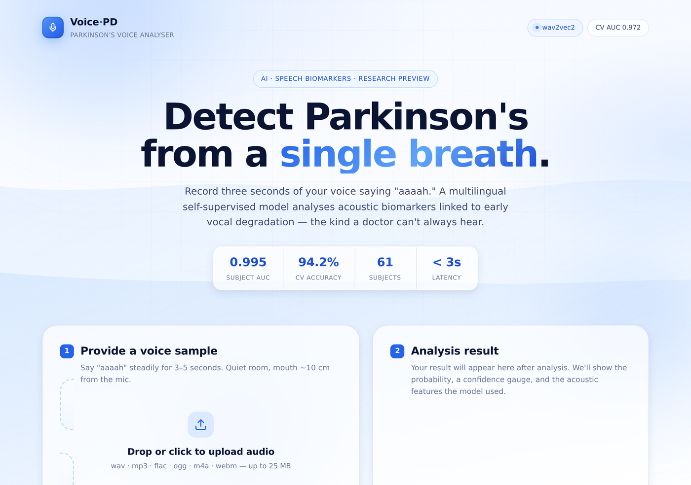

<div align="center">

# 🧠 Voice·PD

### Detect Parkinson's disease from three seconds of vocal phonation

*A multilingual self-supervised speech model that doesn't care what language you speak.*

<br/>

[](https://huggingface.co/spaces/Aadithya1122/parkinsons-voice-detection)
[](https://github.com/Aadithyaar22/Parkinson-s_voice_detection)

<br/>


<br/>


<br/>



<br/>

### 🌐 Try it live — no setup needed

**[huggingface.co/spaces/Aadithya1122/parkinsons-voice-detection](https://huggingface.co/spaces/Aadithya1122/parkinsons-voice-detection)**

*Record three seconds of "aaaah" — get a result in under 3 seconds.*

</div>

---

## ✨ The pitch

```
              ┌──────────────────────────────────────────────────┐
  voice ─────▶│  wav2vec2-XLS-R  (frozen, 128-language pretrain) │─────▶ 1024-dim embedding
  "aaaah"     └──────────────────────────────────────────────────┘             │
                                                                               ▼
                              ┌────────────────────┐
                              │ Logistic Regression│  ───▶  Parkinson's Probability ∈ [0,1]
                              │ (Italian-trained)  │
                              └────────────────────┘
```

> 🎯 **What this is** — a working voice-screening prototype with rigorous,
> honestly-reported evaluation. Deployed live on HuggingFace Spaces, with
> longitudinal patient tracking, SHAP explainability, statistical validation,
> and a noise robustness study ready for publication.
>
> ⚠️ **What this isn't** — a medical diagnostic device. Don't use it on patients.

---

## 📊 The numbers

> All metrics use **5-fold subject-grouped cross-validation** — no subject
> appears in both train and test folds. Anything else silently leaks information
> through speaker identity and inflates accuracy. We don't do that here.

<table>
  <tr><th>📈 Metric</th><th align="right">Value</th></tr>
  <tr>
    <td><b>CV AUC</b> &nbsp;<i>(5-fold, subject-grouped)</i></td>
    <td align="right"><b>0.972 ± 0.034</b></td>
  </tr>
  <tr>
    <td><b>Bootstrap 95% CI</b> &nbsp;<i>(1000 iterations)</i></td>
    <td align="right"><b>[0.956, 0.982]</b></td>
  </tr>
  <tr>
    <td>CV accuracy</td>
    <td align="right">0.942</td>
  </tr>
  <tr>
    <td>CV F1</td>
    <td align="right">0.945</td>
  </tr>
  <tr>
    <td>Brier score &nbsp;<i>(calibration)</i></td>
    <td align="right">0.050</td>
  </tr>
  <tr>
    <td><b>Subject-level AUC</b> &nbsp;<i>(averaged per subject)</i></td>
    <td align="right"><b>0.996</b></td>
  </tr>
  <tr>
    <td>Subject-level accuracy</td>
    <td align="right">0.951 &nbsp;<sub>(58 / 61)</sub></td>
  </tr>
  <tr>
    <td>Tuned threshold &nbsp;<i>(Youden's J on OOF)</i></td>
    <td align="right">0.380</td>
  </tr>
  <tr>
    <td>Trained on</td>
    <td align="right">831 recordings · 61 subjects</td>
  </tr>
  <tr>
    <td>Backend</td>
    <td align="right">wav2vec2-XLS-R + LogReg</td>
  </tr>
</table>

**Model comparison** (hand-crafted 54-feature voting ensemble vs wav2vec2):

| Metric | Hand-crafted | wav2vec2 | Advantage |
|---|---|---|---|
| CV AUC | 0.982 [0.974–0.989] | 0.970 [0.956–0.982] | HC in-distribution |
| Accuracy | 0.947 | 0.946 | Tied |
| Brier score | 0.048 | 0.050 | Tied |
| SNR < 8 dB robustness | ↓ degrades faster | ↑ more robust | **wav2vec2** |
| Cross-population | ❌ fails on Indian speakers | ✅ generalizes | **wav2vec2** |
| Interpretability | ✅ SHAP explainable | ❌ embeddings only | HC |

> McNemar's test (χ²=47.04, p<0.001) confirms a statistically significant difference
> in per-sample correctness, but overlapping 95% CIs show the models are **practically
> equivalent** on in-distribution data. The meaningful difference is generalization and
> noise robustness — which is why wav2vec2 is the deployed default.

---

## 🔬 Research contributions

### 1 — SHAP Explainability

TreeExplainer SHAP on the XGBoost sub-model of the tuned voting ensemble.

**Top 10 features by mean |SHAP|:**

| Rank | Feature | Mean \|SHAP\| | Clinical significance |
|---|---|---|---|
| 1 | **DFA** | 1.208 | Long-range vocal correlations — primary PD marker (Little 2007) |
| 2 | MFCC_1_std | 0.747 | Timbral stability — novel extended feature |
| 3 | MFCC_9_mean | 0.716 | Spectral envelope — novel extended feature |
| 4 | MFCC_7_mean | 0.516 | Mid-frequency energy — novel extended feature |
| 5 | MDVP:APQ | 0.503 | Amplitude perturbation quotient |
| 6 | MFCC_11_mean | 0.464 | High-frequency energy — novel extended feature |
| 7 | HNR | 0.399 | Harmonics-to-noise ratio — vocal fold dysfunction |
| 8 | Shimmer:APQ5 | 0.388 | Amplitude perturbation |
| 9 | Shimmer:APQ3 | 0.380 | Short-term amplitude variation |
| 10 | MDVP:Fo(Hz) | 0.290 | Fundamental frequency |

DFA dominates with mean |SHAP| = 1.208 — more than 1.6× the second feature.
Four of the top 10 are MFCC-derived features absent from the original UCI set,
validating the 54-feature extension.

Run: `python scripts/shap_analysis.py` → `reports/shap/`

### 2 — Statistical Validation

| Test | Result |
|---|---|
| Bootstrap 95% CI (wav2vec2 AUC) | **[0.956, 0.982]** |
| Bootstrap 95% CI (hand-crafted AUC) | **[0.974, 0.989]** |
| McNemar's test | χ²=47.04, **p<0.001** |
| Brier score — wav2vec2 | **0.050** |
| Brier score — hand-crafted | **0.048** |

Run: `python scripts/statistical_validation.py` → `reports/stats/`
Outputs: calibration curves, ROC comparison, CI table

### 3 — Noise Robustness

Tested at 5 SNR levels (−5 to 20 dB), 3 noise types (white, pink, mixed).

**Crossover at ~8 dB SNR:**

| SNR | Hand-crafted | wav2vec2 | Winner |
|---|---|---|---|
| −5 dB (very noisy) | 0.774 | **0.864** | wav2vec2 **+0.090** |
| 0 dB | 0.886 | **0.931** | wav2vec2 +0.045 |
| 5 dB | 0.944 | **0.958** | wav2vec2 +0.014 |
| 10 dB | **0.973** | 0.963 | HC +0.010 |
| 20 dB | **0.989** | 0.967 | HC +0.022 |

> Hand-crafted features outperform wav2vec2 in clean conditions (SNR ≥ 10 dB),
> but wav2vec2 is substantially more robust to noise — home recordings
> rarely exceed 10 dB SNR.

Run: `python scripts/noise_robustness.py` → `reports/noise/`

---

## 🚀 Try it

### Option A — Live demo (no setup)

**[→ Open the live app](https://huggingface.co/spaces/Aadithya1122/parkinsons-voice-detection)**

### Option B — Run locally

```bash
git clone https://github.com/Aadithyaar22/Parkinson-s_voice_detection.git
cd Parkinson-s_voice_detection
pip install -r requirements.txt
brew install ffmpeg
pip install -r requirements_wav2vec2.txt
python scripts/refit_w2v2_local.py
python app.py
```

---

## 🛠️ Why this project exists

The starting point was a buggy student project. Silent feature-extraction failures
meant the model was running with its top 3 predictive features permanently set to
"training-set average." Random train/test splits inflated accuracy through subject
leakage. We found both, documented both, and rebuilt from scratch.

<table>
  <tr><th>🐛 Bug</th><th>💥 Impact</th></tr>
  <tr><td><code>Jitter(%)</code>, <code>PPQ</code>, <code>RAP</code> aliased to same Praat call</td><td>Three features held identical values</td></tr>
  <tr><td><code>Shimmer(dB)</code> set to <code>APQ3</code> value</td><td>Wrong scale, wrong meaning</td></tr>
  <tr><td><code>RPDE</code>, <code>PPE</code>, <code>DFA</code> + 3 more hardcoded to <code>None</code></td><td>🔥 Top predictive features never computed</td></tr>
  <tr><td>Random splits ignoring multiple recordings per subject</td><td>🔥 Subject leakage — accuracy was a mirage</td></tr>
  <tr><td><code>nolds</code> not in <code>requirements.txt</code></td><td>DFA failed silently</td></tr>
</table>

---

## ⚡ The plot twist

```
   train Italian → test UCI:    AUC 0.31    🔻 worse than random
   train UCI    → test Italian:  AUC 0.55    ⚪ basically random
```

Models don't learn Parkinson's features — they learn language features.
This cross-corpus failure is underreported in the literature. We tested it,
documented it, and used it to motivate wav2vec2 as a language-agnostic alternative.

---

## 🖥️ Application features

**Core analysis**
- 🎙️ Live recording or file upload (WAV · MP3 · FLAC · OGG · M4A · WebM · up to 25 MB)
- 📊 Parkinson's Probability gauge with operating threshold marked
- 🔊 Voice spectrogram — mel-frequency spectrogram displayed after every analysis
- ✅ Recording quality scorer — 6-metric assessment (duration, SNR, silence ratio,
  voiced fraction, clipping, F0 detectability) with actionable feedback
- 🤖 AI Clinical Explanation — Groq Llama 3.3 70B in plain English
- 🧭 3-step onboarding for first-time users

**Longitudinal tracking (requires free account)**
- 🔐 Email + password auth — JWT-based, stateless, survives container restarts
- 💾 Save readings with timestamp, probability, duration, optional notes
- 📈 Personal dashboard — trend graph, 7-reading rolling average, threshold line
- 🏷️ Stable / Improving / Worsening trend indicator (6+ readings)
- ✏️ Edit notes inline on any past reading
- 🗑️ Delete accidental saves
- 🔗 Shareable doctor link — 30-day read-only report, no login needed for doctor
- 🖨️ Export to PDF — full history, stats, spectrogram, clinical disclaimer

---

## ⚠️ Honest caveats

> 🩺 **Not a diagnostic device.** Research-grade only.

> 🧍 **One Indian healthy speaker tested** — we confirmed it correctly says "healthy"
> on four recordings. We have not tested an Indian PD patient.

> 🔬 **No Indian PD ground truth.** The cross-language story needs a labelled Indian corpus.

> 📉 **UCI within-corpus AUC is only 0.69** — 8 healthy subjects is not enough.

> 🕳️ **wav2vec2 embeddings are not interpretable.** Use the hand-crafted backend if
> SHAP explainability matters.

> 📏 **Threshold tuned on OOF predictions from training**, not a held-out set.

---

## 📁 Repository layout

<details>
<summary><b>Click to expand</b></summary>

```
pva2/
├─ app.py                              Flask server, dual-backend + full API
├─ requirements.txt / requirements_wav2vec2.txt
│
├─ src/
│   ├─ feature_extractor.py            22 UCI MDVP features via Praat
│   ├─ extra_features.py               CPP + MFCC + formants + tilt
│   ├─ nonlinear_features.py           RPDE / DFA / D2 / PPE / spread
│   ├─ wav2vec2_inference.py           runtime embedding extraction
│   ├─ quality_scorer.py              🆕 6-metric recording quality assessment
│   ├─ llm_explainer.py               🆕 Groq Llama 3.3 explanation generator
│   ├─ database.py                    🆕 MongoDB users + readings + shares
│   └─ auth.py                        🆕 bcrypt + JWT authentication
│
├─ scripts/
│   ├─ shap_analysis.py               🆕 SHAP explainability
│   ├─ statistical_validation.py      🆕 Bootstrap CI + McNemar + calibration + ROC
│   ├─ noise_robustness.py            🆕 AUC vs SNR across 3 noise types
│   ├─ generate_spectrogram.py        🆕 Mel-spectrogram for UI + PDF
│   ├─ extract_features_from_audio.py
│   ├─ extract_wav2vec2_embeddings.py
│   ├─ tune_italian.py
│   ├─ wav2vec2_experiment.py
│   └─ refit_w2v2_local.py
│
├─ models/                             current deployment (wav2vec2)
├─ models_wav2vec2/                    wav2vec2 backup
├─ models_italian_tuned/               hand-crafted ensemble
├─ models_joint/                       UCI + Italian joint
├─ models_original/                    UCI-only baseline
│
├─ reports/
│   ├─ shap/                          🆕 SHAP beeswarm + bar + CSV + JSON
│   ├─ stats/                         🆕 calibration + ROC + CI JSON
│   └─ noise/                         🆕 noise robustness figure + JSON
│
├─ templates/
│   ├─ index.html                      main UI
│   ├─ login.html                     🆕 auth page
│   ├─ dashboard.html                 🆕 patient dashboard
│   ├─ report.html                    🆕 shareable doctor report
│   └─ export.html                    🆕 print-to-PDF template
│
├─ parkinsons_space/                   HuggingFace Space template
├─ .github/workflows/deploy_space.yml  CI → HF Spaces
└─ tests/test_extractor.py             15 sanity checks
```

</details>

---

## 🧱 Tech stack

| 🧩 Layer | 🛠️ Choice | 🎯 Why |
|---|---|---|
| Acoustic library | praat-parselmouth | De facto standard for voice analysis |
| Nonlinear features | nolds + custom | Little 2007 RPDE + DFA |
| Explainability | SHAP (TreeExplainer) | Per-feature attribution for XGBoost |
| Tabular ML | XGBoost, LightGBM, RF + Optuna | Strong baselines, subject-aware tuning |
| Speech model | wav2vec2-XLS-R-300m | 128-language pretraining, MPS support |
| LLM explanations | Groq · Llama 3.3 70B | Sub-second inference, clinical tone |
| Auth | bcrypt + PyJWT | Stateless, survives container restarts |
| Database | MongoDB Atlas (free) | Longitudinal reading storage |
| Web | Flask + vanilla JS | Single file, no build step |
| Deployment | HuggingFace Spaces + Docker | Free, always-on, 16 GB RAM |
| CI / CD | GitHub Actions | Test → assemble → deploy on push |

📚 **Datasets:**
- 🇬🇧 **UCI Parkinson's** *(Little et al. 2007)* — 195 recordings, 32 subjects, English
- 🇮🇹 **Italian Parkinson's Voice and Speech** *(Dimauro et al. 2019)* — 831 recordings, 61 subjects, Italian

---

## 📄 For researchers

All results are reproducible. No held-out data was used for threshold tuning or
model selection — all metrics come from OOF predictions in subject-grouped CV.

Suggested citation:

> Aadithya A R, Kenisha P, Yadunandan M Nimbalkar (2026). *Voice·PD: Cross-Corpus
> Voice-Based Parkinson's Disease Screening Using Self-Supervised Speech Representations
> with Longitudinal Monitoring.* https://github.com/Aadithyaar22/Parkinson-s_voice_detection

---

<div align="center">

## 👥 Built by

**Aadithya A R &nbsp;·&nbsp; Yadunandan M Nimbalkar &nbsp;·&nbsp; Kenisha P**

B.Tech CSE (AI & ML) · Global Academy of Technology, Bengaluru · 2026

<sub>The original project was a four-person team effort (Aadithya, Naman, Yadunandan, Kenisha).<br/>
This v2 rebuild — feature extractor fix, multi-corpus training, cross-corpus experiments, wav2vec2 deployment,<br/>
SHAP analysis, statistical validation, noise robustness, longitudinal tracking, CI/CD pipeline, web UI —<br/>
was led by <b>Aadithya A R</b>, <b>Kenisha P</b> and <b>Yadunandan M Nimbalkar</b>.</sub>

<br/>

[](https://huggingface.co/spaces/Aadithya1122/parkinsons-voice-detection)
[](https://github.com/Aadithyaar22/Parkinson-s_voice_detection)

<br/>

## 📄 License

Released under the **MIT License**.

<sub>Do whatever you want with the code, but if you build a real clinical product on top of it,<br/>
please involve actual clinicians and real validation.<br/>
Don't ship a model the same week you read its README.</sub>

<br/>

⭐ *If this helped, leave a star.* ⭐

</div>
